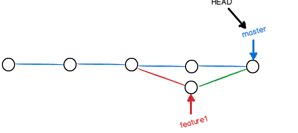
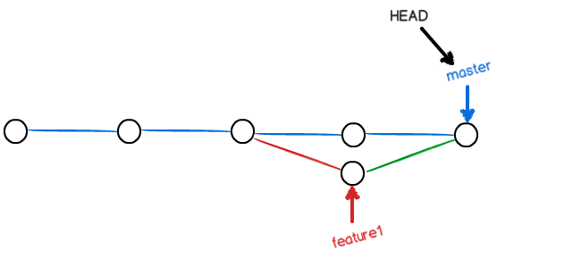

# git 学习笔记

`HAED`表示当前版本，`HEAD^` 表示上一个版本，`HEAD^^`表示上上版本，`HEAD～100`表示上一百个版本

**git reflog**  查看命令历史

**git merge** 命令合并指定分支和当前分支

通常合并（merge）分支时，会采用Fast forward模式，如下图。在这种模式下，删除分支后，会丢掉合并该分支的信息（类似于无痕？？）。

<u>合并前</u>

<u>*合并后*</u>

测试步骤：先新建dev分支，并修改reademe文件，然后提交commit，然后切换到master分支，进行merge

`git checkout -b dev` 

`git add .`

`git commit -m 修改git学习笔记`

`git push` 

`git checkout main` 

`git merge -ff`

`git log` 如下所示

如果强制禁用Fast forward模式，git会在merge的时候生成一个新的commit信息，这样就可以在历史记录找到合并分支的信息

测试步骤：切换到dev分支，并修改reademe文件，然后提交commit，然后切换到master分支，进行merge，进行强制禁用Fast forword命令

`git checkout dev` 

`git add .`

`git commit -m 修改git学习笔记`

`git push` 

`git checkout main` 

`git merge --no-ff -m "merge with no-ff" dev`

然后看`git log`

    commit f92520548411f18277dd937a91503b620268a91dq(HEAD -> main)
    Merge: e33c054 9fb785d
    Author: Skylar <shuanghuili@oppo.com>
    Date:   Thu Dec 3 16:36:50 2020 +0800
    
    merge with no-ff
    
    commit 9fb785d8285d2cc92af6b604af5e30b0fbbb3771 (origin/dev, dev)
    Author: Skylar <shuanghuili@oppo.com>
    Date:   Thu Dec 3 16:35:23 2020 +0800
    
    :...skipping...
    commit f92520548411f18277dd937a91503b620268a91d (HEAD -> main)
    Merge: e33c054 9fb785d
    Author: Skylar <shuanghuili@oppo.com>
    Date:   Thu Dec 3 16:36:50 2020 +0800
    
    merge with no-ff
    
    commit 9fb785d8285d2cc92af6b604af5e30b0fbbb3771 (origin/dev, dev)
    Author: Skylar <shuanghuili@oppo.com>
    Date:   Thu Dec 3 16:35:23 2020 +0800
    
    修改git学习笔记

由打印出来的log发现，其每一步都被保存了

