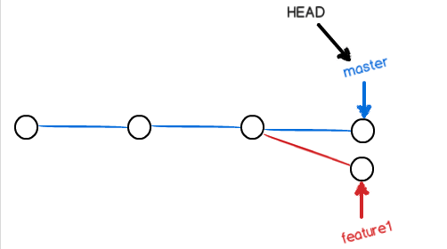

# git 学习笔记

`HAED`表示当前版本，`HEAD^` 表示上一个版本，`HEAD^^`表示上上版本，`HEAD～100`表示上一百个版本

**git reflog**  查看命令历史

**git merge** 命令合并指定分支和当前分支

通常合并（merge）分支时，会采用Fast forward模式，如下图。在这种模式下，删除分支后，会丢掉合并该分支的信息。


<u>合并前</u>


<u>*合并后*</u>


测试步骤：先新建dev分支，并修改reademe文件，然后提交commit，然后切换到master分支，进行merge

`git checkout -b dev` 

`git add .`

`git commit -m 修改git学习笔记`

`git push` 

`git checkout main` 

`git merge -ff`

`git log --graph --pretty=oneline --abbrev-commit` 如下所示

```js

commit 10d3f57579dc6b1fc61ca9a68d6ae95b06faa738 (HEAD -> main)
Merge: c709589 475b2c7
Author: Skylar <shuanghuili@oppo.com>
Date:   Thu Dec 3 17:25:26 2020 +0800

    测试merge -ff命令Merge branch 'dev' into main

commit 475b2c79af219a7293653d39703694aae588fcde (origin/dev, dev)
Author: Skylar <shuanghuili@oppo.com>
Date:   Thu Dec 3 17:24:42 2020 +0800


```

由下图可以看到当分支采用merge --ff的方式合并以后，就会合并到一个分支上，此时在dev上rebase就不会出现commit，但如果dev分支没有和采用fast-forward方式合并到一个分支，git merge就会出现commit，详见<https://git-scm.com/docs/git-merge>

```js

* f0c8ae2 (HEAD -> dev) dev 修改git笔记
* b221a2b (origin/main, origin/HEAD, main) 增加分支管理图
*   10d3f57 测试merge -ff命令Merge branch 'dev' into main
|\  
| * 475b2c7 (origin/dev) dev分支提交测试-ff命令代码
* | c709589 测试git merge 命令
|\| 
| * 012415d 修改git学习笔记

```


如果强制禁用Fast forward模式，git会在merge的时候生成一个新的commit信息，这样就可以在历史记录找到合并分支的信息

测试步骤：切换到dev分支，并修改reademe文件，然后提交commit，然后切换到master分支，进行merge，进行强制禁用Fast forword命令

`git checkout dev` 

`git add .`

`git commit -m 修改git学习笔记`

`git push` 

`git checkout main` 

`git merge --no-ff -m "merge with no-ff" dev`

然后看`git log`


    commit f92520548411f18277dd937a91503b620268a91dq(HEAD -> main)
    Merge: e33c054 9fb785d
    Author: Skylar <shuanghuili@oppo.com>
    Date:   Thu Dec 3 16:36:50 2020 +0800
    
    merge with no-ff
    
    commit 9fb785d8285d2cc92af6b604af5e30b0fbbb3771 (origin/dev, dev)
    Author: Skylar <shuanghuili@oppo.com>
    Date:   Thu Dec 3 16:35:23 2020 +0800
    
    修改git学习笔记

由下图可见，git merge --no-ff 仍然会保存分支信息，每次commit都是在自己的分支上进行的commit操作

```js

* f0c8ae2 (HEAD -> dev) dev 修改git笔记
* b221a2b (origin/main, origin/HEAD, main) 增加分支管理图
*   10d3f57 测试merge -ff命令Merge branch 'dev' into main
|\  
| * 475b2c7 (origin/dev) dev分支提交测试-ff命令代码
* | c709589 测试git merge 命令
|\| 
| * 012415d 修改git学习笔记
* | 249d772 修改git笔记
* | e58df6d 修改git笔记
* | f925205 merge with no-ff
|\| 
| * 9fb785d 修改git学习笔记
* | e33c054 测试merge --no--ff
|\| 
| * 76bc6e4 修改git学习笔记
* | 3cdfc4d 测试--no--ff命令
|/  
* db01965 initial
* 0ef54cd Initial commit

```


